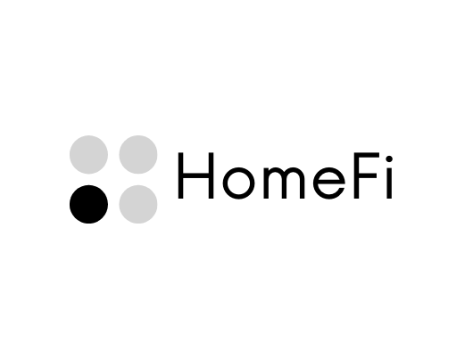
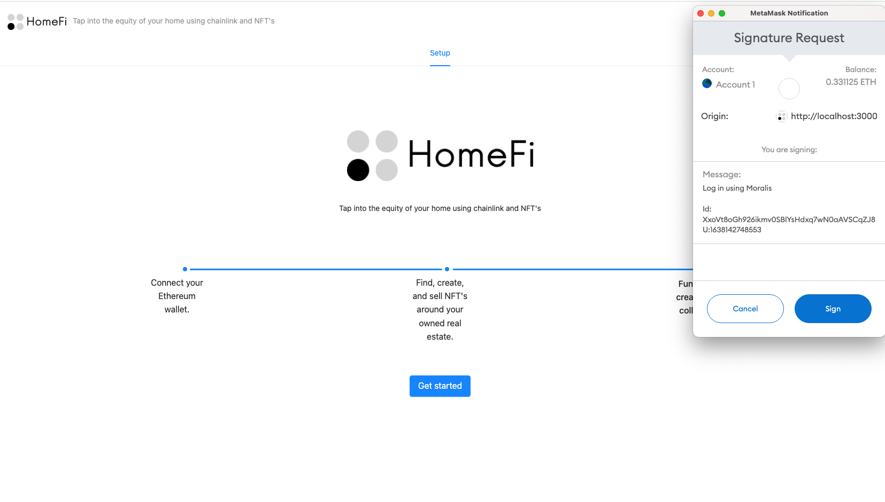
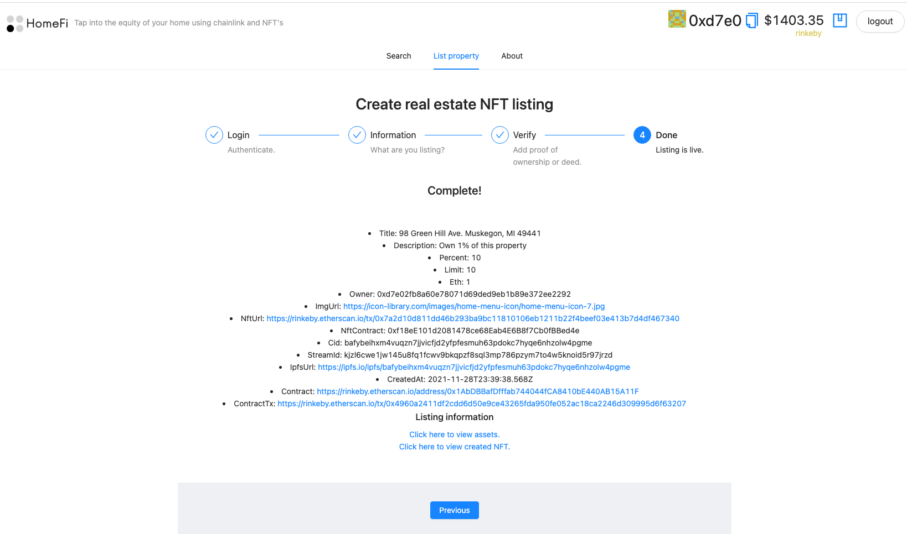
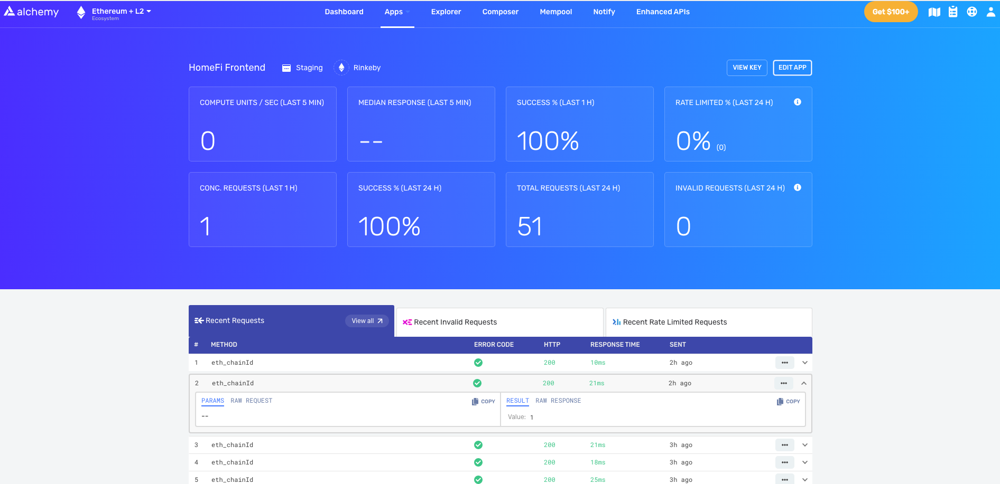
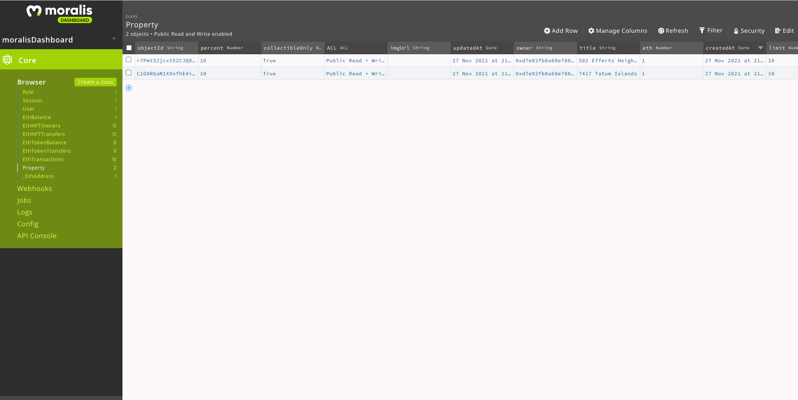
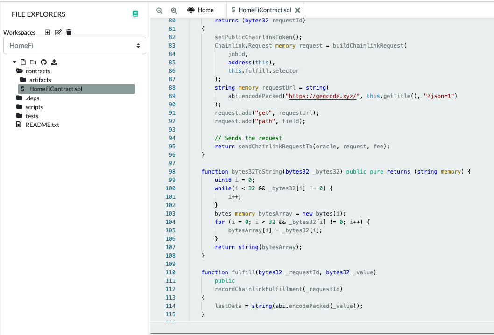
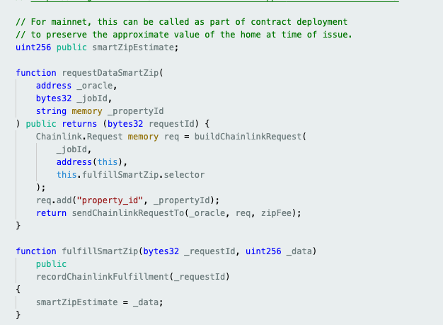

    

 

## HomeFi

Tap into the equity of your home using Chainlink, IPFS, and NFT's.

Built for the Chainlink 2021 Fall hackathon.

### What it does

HomeFi uses Chainlink and a combination of web3 services to administer and deploy smart contracts that represent home equity lines of credit.

Users can create the terms of the fundraise and allow others to deposit to it. Proof of ownership, such as a title or deed, is uploaded on HomeFi during the listing process. The app then collects the user's signature and uploads it as an image file to the IPFS folder for the property.
After upload, prospective buyers/participants (up to the limit specified by the issuer) can discover previously-created listings and purchase units of ownership using attachments to the NFT metadata source of truth.

Each property gets deployed as its own smart contract. With the price/appraised value of the property fixed to the contract.

<b>Note this app is a prototype and would need additional work to be production ready.</b>

### Requirements

HomeFi has the following environment variables for interfacing with core blockchain services:

<pre>
    REACT_APP_NFT_PORT_KEY=XXX # your nftport.xyz api key
    REACT_APP_STORAGE_KEY=XXX  # your web3.storage api key
    REACT_APP_MORALIS_ID=XXX # your moralis app id
    REACT_APP_MORALIS_SERVER=XXX # your moralis server id
    REACT_APP_ALCHEMY_KEY=XXX # your network-specific alchemy key
</pre>

Sponsors:
Chainlink: Each listed property is deployed as its own distinct smart contract. The smart contract maintains the owner and listing terms, as well as all the payers. A chainlink API call is made to fetch information ( appraise value, lat/lng location) dynamically about the property and save it to each contract.
Moralis: Distributed mutable data storage for the marketplace metadata. Each contract/deployment is saved to a Moralis location. Moralis also facilitates app authentication.
IPFS / Filecoin: Store property files, any signatures, and proof of ownership (ex: deed/title documents).
NFTPort: NFT issuance for the issued real estate backed NFT (minting). The NFT is created at the time of contract creation.
Alchemy: Maintains app high availability and serves app requests for the demo (could be updated to serve a production deployment).
SmartZip: At or near the time of deployment, the property could be appraised. The smartzip oracle is integrated into the smart contract and can be (optionally) invoked to set the smartZipEstimate on the contract itself to track the property's value.

### Running the app

Define the above environment variables and run:

`yarn && yarn start`

By default, the app is configured for blockchain interactions against the `rinkeby` eth testnet.

<!--
Tap into the equity of your home.
-->

### Screenshots

#### Home page and login

#### Creating a new listing

#### Signature is collected from the uploader

#### Completed upload

#### Uploaded IPFS content (deed and signature)

#### NFT created on upload

#### Once listed, property is available or search

#### Alchemy app serves chain requests

#### Moralis DB backs up all uploaded listings

#### Chainlink does lookup of property value and confirms location

#### SmartZip invocable contract method

-->

<!--

ex:
https://rinkeby.etherscan.io/tx/0x68888984adab214ceca46d539290b4e9fcc7851e80796723abf2a03ea58f07bb
https://ipfs.io/ipfs/bafybeigrilyu2oxnhywaqn6ff6wciqfyzf254mpmla4dc4sohuhbmcgpqm
---
Chainlink
Moralis
Filecoin

Demo flow:
* Stat/web news about home/housing market
* NFT platforms for real estate exist, but one of the biggest problems is governance.
* Capped out at 10%, can't relinquish more than that.
* Ex: 1.0 eth per 1% ownership (10 max percent, 10 participants), // effective default is 1 eth for 1% ~4k, ~400k net valuation.
* Create form flow having person upload proof of ownership of home
* Create terms to allow others to deposit to it
* Use react signature canvas to collect the user signature (checking against the deed) and uploading as an image file to the IPFS folder for the property.
* Show completion page (ceramic stream, ipfs folder, and nftport-created NFT).
* After being uploaded, prospective buyers/participants (up to the limit specified by the issuer) can purchase units of ownership around the NFT.
* Property NFT's uploaded can either be ownership-oriented or simply collectible (i.e. could be used in the case of a celebrity or notable location).
* Generate NFT after form completion
* Uploaded proof of ownership
- The technology here could be leveraged for other esignature purpsoes as well (beyond real estate), where you want to esign a document and have the signature tied to the document in a filecoin directory.
- This actually serves that purpose but with a self-signed title document.
* API call from chainlink to get house price estimate.
* Login (powered by moralis).
* Search listings (backed by moralis).

### Notes

One of the biggest problems is transferring and representing ownership of real estate on a blockchain is ensuring governance:

- Who enforces that the ownership is represented by this particular NFT?
- If ownership is distributed, who is responsible for maintaining the property?
- How are duplicate or unauthorized NFT's avoided?

Create a limited partnership (LP), issue a token on whatever blockchain you want. Make the bylaws of the LP state that ownership and voting rights for LP is dictated by ownership of said token. Transfer ownership of one or more pieces of real estate to the LP. Whether a single home or bundle. Now you have this LP which owns one or more assets, and you can transfer around ownership of the LP itself by just sending tokens around.

-->

### Future work

### Useful links

- https://chainlink-fall-hackathon-2021.devpost.com/ --
